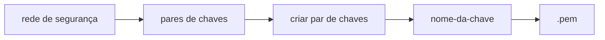
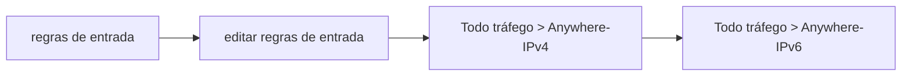

# Tecnologias

Terraform
AWS CLI
Ansible

## Informações
São os provedores necessários. No nosso caso aqui, como nós vamos abrir a AWS, ele vai criar esse provedor da AWS.

    required_providers {  
        aws  =  {
    	    source = "hashicorp/aws"
    	    version = "~> 3.27"
        }
    }

O provedor também teve umas configurações, que nós vamos colocar no caso aqui, `provider aws`. Elas são: o perfil ou _profile_, que é o padrão, e a região, que no nosso caso é a região `us-west-2`, que é a região do Oregon nos Estados Unidos.

    provider  "aws" {
	    profile  =  "default"
	    region  =  "us-west-2"
    }

## AWS

ami do ubuntu 20.4 escolhido na instância da aws
ps: pegar de acordo com região pois ela altera

    ami  =  "ami-00712dae9a53f8c15"
instâncias possíveis de serem executadas

    instance_type  =  "t2.micro"
    
nome que nós podemos dar para nossa instância para ficar fácil de lermos

    tags  =  {
    	Name = "ExampleAppServerInstance"
    }

## Terraform Init

Nós temos que começar com o Terraform e agora que nós já criamos o nosso arquivo, podemos iniciar o Terraform, então vamos usar o `terraform init`. Ele vai baixar algumas configurações, alguns  _plug-ins_  para podermos utilizar o nosso provedor.

    terraform init

## Terraform Plan

É para vermos o que vai acontecer quando realmente executarmos.

    terraform plan

## Terraform apply

Comando para criar a máquina e aplicar nossas configurações

    terraform apply
Quanto solicitado no terminal

    yes

# Acessar a máquina
Uma forma normal de nós podermos acessar é via SSH.

**Criar par de chaves SSH**

Dentro do bloco de recurso vou colocar uma *tag* chamada `key-name`

    key_name  =  "nome-da-chave"
    
No terminal novamente

    terraform apply
    
Pegar esse arquivo e vai deixar disponível leitura e escrita só para quem é o autor daquele arquivo

    chmod 400 nome-da-chave

**Grupo de segurança**
Ele tem algumas regras, as regras de entrada e as regras de saída. No caso aqui, nós vamos editar essas regras para permitir a nossa conexão.
**Regras de entrada**

**Regras de saída**

**Rode novamente**
rodar comando da aws para conectar à instância

## Criar arquivos com Terraform

Vamos precisar abrir aqui dentro do nosso recurso da nossa máquina uma nova _tag_ que chama `user_data`, que é os dados de usuário.

    user_data  =  <<-EOF
    
			        #!/bin/bash
			        
			        cd /home/ubuntu
			        
			        echo "<h1>Feito com Terraform<h1/>" > index.html
			        
			        nohup busybox httpd -f -p 8080 &
			        
			        EOF

Ele começa com o símbolo de menor, um hífen e EOF, que significa _end of file_, fim do arquivo. `<< -EOF`.
# terraform-ansible-project-go
